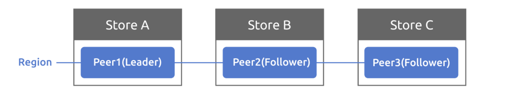

该项目有 3 个你需要做的部分，包括：

- 实现基本的 Raft 算法
- 在 Raft 之上搭建一个容错的 KV 服务器
- 增加raftlog GC和snapshot的支持

## Part B

### 实施对等存储

在本部分中，您将使用a部分中实现的Raft模块构建一个容错键值存储服务。您的键值服务将是一个复制状态机，由几个使用Raft进行复制的键值服务器组成。您的密钥/值服务应该继续处理客户机请求，只要大多数服务器处于活动状态并且可以通信，尽管存在其他故障或网络分区。

在project1中，您已经实现了一个独立的kv服务器，因此您应该已经熟悉kv服务器API和存储接口。

在介绍代码之前，您需要先了解三个术语：proto/proto/metapb.proto中定义的Store、Peer和Region。

- Store代表tinykv服务器的一个实例
- Peer表示在存储上运行的Raft节点
- 区域是对等点的集合，也称为Raft组

为简单起见，project2 的 Store 上只有一个 Peer，集群中只有一个 Region。所以你现在不需要考虑Region的范围。在project3中将进一步引入多个区域。

### The Code

首先，您应该查看的代码是位于kv/storage/raft_storage/raft_server.go中的RaftStorage，它也实现了存储接口。与StandaloneStorage不同，StandaloneStorage直接从底层引擎写入或读取数据，RaftStorage它首先向Raft发送每个写入或读取请求，然后在Raft提交请求后向底层引擎执行实际的写入和读取操作。通过这种方式，它可以保持多个存储之间的一致性。

RaftStorage主要创建一个用于驱动Raft的Raftstore。调用Reader或Write函数时，它实际上会将proto/proto/raft_cmdpb.proto中定义的带有四种基本命令类型（Get/Put/Delete/Snap）的RaftCmdRequest发送到raftstore by channel（通道的接收者是raftWorker的raftCh），并在raft提交并应用命令后返回响应。Reader And Write函数的kvrpc.Context参数现在很有用，它从客户端的角度携带区域信息，并作为请求的头传递。可能信息是错误的或过时的，所以raftstore需要检查这些信息并决定是否提出请求。

Then, here comes the core of TinyKV — raftstore. The structure is a little complicated, you can read the reference of TiKV to give you a better understanding of the design:

https://pingcap.com/blog-cn/the-design-and-implementation-of-multi-raft/#raftstore (Chinese Version)
https://pingcap.com/blog/2017-08-15-multi-raft/#raftstore (English Version)

raftstore的入口为 Raftstore ，见kv/raftstore/raftstore.go。它启动了一些工作人员异步处理特定任务，其中大多数现在不使用，因此您可以忽略它们。你所需要关注的就是raftWorker。（kv/raftstore/raftu-worker.go）

整个过程分为两个部分：raft工人轮询raftCh以获取消息，消息包括用于驱动raft模块的基本勾号(base tick)和作为raft条目提出的raft命令；它从Raft模块获取并处理就绪信息，包括发送Raft消息、保持状态、将提交的条目应用到状态机。应用后，将响应返回给客户端。

### Implement peer storage
### 实现对等存储

对等存储是您通过第A部分中的存储接口与之交互的存储，但除了raft日志之外，对等存储还管理其他持久化元数据，这对于重启后恢复一致状态机非常重要。此外，proto/proto/raft_serverpb.proto中定义了三种重要状态：

- RaftLocalState：用于存储当前Raft和最后一个日志索引的硬状态。

- RaftApplyState：用于存储Raft应用的最后一个日志索引和一些截断的日志信息。

RegionLocalState：用于存储此存储上的区域信息和相应的对等状态。Normal表示该对等点正常，Tombstone表示该对等点已从区域中删除，无法加入Raft组。

这些状态存储在两个獾(badger)实例中：raftdb和kvdb：

- raftdb存储raft日志和RaftLocalState
- kvdb将键值数据存储在不同的列族RegionLocalState和RaftApplyState中。您可以将kvdb视为本文中提到的状态机

格式如下，kv/raftstore/meta中提供了一些帮助函数，并将它们设置为badger with writebatch.SetMeta（）。

Key	                   KeyFormat	                    Value	        DB
raft_log_key	    0x01 0x02 region_id 0x01 log_idx	Entry	        raft
raft_state_key	    0x01 0x02 region_id 0x02	    RaftLocalState	    raft
apply_state_key	    0x01 0x02 region_id 0x03	    RaftApplyState	    kv
region_state_key	0x01 0x03 region_id 0x01	    RegionLocalState	kv

您可能想知道为什么TinyKV需要两个badger实例。实际上，它只能使用一个獾来存储raft日志和状态机数据。分为两个实例只是为了与TiKV设计保持一致。

这些元数据应该在“PeerStorage”中创建和更新。创建 PeerStorage 时，请参阅 `kvraftstorepeer_storage.go`。它初始化这个Peer的RaftLocalState、RaftApplyState，或者在重启的情况下从底层引擎获取之前的值。注意RAFT_INIT_LOG_TERM和RAFT_INIT_LOG_INDEX的值都是5（只要大于1），但不是0，不设置为0是为了区分peer修改后被动创建的情况。你现在可能不太明白，所以记住它，当你实施conf更改时，细节将在project3b中描述。

这部分你需要实现的代码只有一个函数：`PeerStorage.SaveReadyState`，这个函数的作用是将`raft.Ready`中的数据保存到badger，包括追加日志条目和保存Raft硬状态。

要附加日志项，只需将所有日志项保存在raft.Ready.entries中，并删除以前附加的、永远不会提交的日志项。另外，更新对等存储的RaftLocalState并将其保存到raftdb。

要保存硬状态也很容易，只需更新对等存储的RaftLocalState.HardState并将其保存到raftdb。

提示：

- 使用WriteBatch立即保存这些状态。

- 有关如何读取和写入这些状态，请参阅peer_storage.go上的其他函数。

### Implement Raft ready process
### 实施筏式准备流程

在Project2部分A中，您已构建基于刻度的筏模块。现在您需要编写外部进程来驱动它。大多数代码已经在kv / roaftstore / peer_msg_mandler.go和kv / raftstore / peer.go下实现。因此，您需要了解代码并完成ProposeraftCommand和Handleraftready的逻辑。以下是对框架的一些解释。

节点已使用PeerStorage创建并存储在peer中。在raft worker中，您可以看到它使用peerMsgHandler将对等机包装起来。peerMsgHandler主要有两个功能：一个是HandleMsg，另一个是HandleRaftReady。

HandleMsg处理从raftCh接收的所有消息，包括调用RawNode.Tick（）来驱动Raft的MsgTypeTick、包装来自客户端的请求的MsgTypeRaftCmd和在Raft对等方之间传输的消息MsgTypeRaftMessage。所有消息类型都在kv/raftstore/message/msg.go中定义。您可以查看详细信息，其中一些将在以下部分中使用。

处理消息后，Raft节点应该有一些状态更新。因此，HandleRaftReady应该从Raft模块准备就绪，并执行相应的操作，如持久化日志条目、应用提交的条目以及通过网络向其他对等方发送Raft消息。

在伪代码中，raftstore 使用 Raft 如下：

for {
select {
case <-s.Ticker:
Node.Tick()
default:
if Node.HasReady() {
rd := Node.Ready()
saveToStorage(rd.State, rd.Entries, rd.Snapshot)
send(rd.Messages)
for _, entry := range rd.CommittedEntries {
process(entry)
}
s.Node.Advance(rd)
}
}

在此之后，整个读或写过程如下：

- 客户机调用 RPC RawGet/RawPut/RawDelete/RawScan
- RPC 处理程序调用与 RaftStorage 相关的方法
- RaftStorage 向 raftstore 发送一个 Raft 命令请求，并等待响应
- 将 Raft 命令请求作为一个 Raft 日志提出
- Raft 模块附加日志，并通过 PeerStorage 持久化
- Raft 模块提交日志
- Raft worker在处理Raft ready时执行Raft命令，并通过回调返回响应
- RaftStorage 接收回调的响应并返回给 RPC 处理程序
- RPC 处理程序执行一些操作并将 RPC 响应返回给客户机。

您应该运行makeproject2b以通过所有测试。整个测试运行一个模拟集群，其中包括多个TinyKV实例和一个模拟网络。它执行一些读写操作，并检查返回值是否符合预期。

需要注意的是，错误处理是通过测试的一个重要部分。您可能已经注意到proto/proto/errorpb.proto中定义了一些错误，错误是gRPC响应的一个字段。此外，实现error接口的相应错误在kv/raftstore/util/error.go中定义，因此您可以将它们用作函数的返回值。

在这个阶段，您可以考虑这些错误，其他将在项目3中进行处理：

ErrNotLeader：raft命令是针对跟随者提出的。因此，使用它让客户机尝试其他对等机。

ErrStaleCommand：可能是由于领导者的更改，某些日志未提交并被新领导者的日志覆盖。但客户不知道，仍在等待响应。因此，您应该返回它，让客户端知道并再次重试该命令。

提示：

- PeerStorage实现Raft模块的存储接口，您应该使用提供的方法SaveRaftReady（）来持久化与Raft相关的状态。

- 使用engine_util中的WriteBatch以原子方式进行多个写入，例如，您需要确保在一个写入批中应用提交的条目并更新应用的索引。

- 使用Transport向其他对等方发送raft消息，它位于GlobalContext中，

- 如果get RPC不是多数的一部分，并且没有最新数据，则服务器不应完成它。您可以将get操作放入raft日志中，或者对raft文章第8节中描述的只读操作进行优化。

- 应用日志条目时，不要忘记更新并保持应用状态。

- 您可以像TiKV一样以异步方式应用提交的Raft日志条目。虽然提高性能是一个巨大的挑战，但这并不是必须的。

- 建议时记录命令的回调，应用后返回回调。

- 对于snap命令响应，应将badger Txn显式设置为callback。

